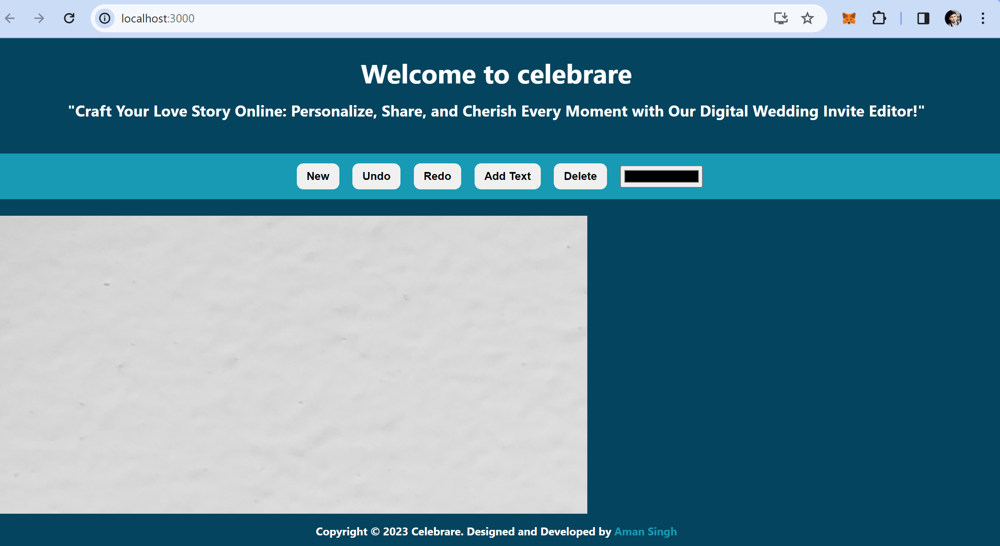

<br/>
<p align="center">
  <h3 align="center">Celebrare-Demo</h3>

  <p align="center">
    Craft Your Love Story Online: Personalize, Share, and Cherish Every Moment with Our Digital Wedding Invite Editor!
    <br/>
    <br/>
    <a href="https://amansingh-text-editor.netlify.app">Live Demo Link</a>
    .
  </p>
</p>


## About The Project



Basic Editing Web Application with features including Adding Text, Undo, Redo, Colour Change.

## Built With

This project is built mainly using Reactjs and Fabricjs library for making Canvas.

## Getting Started

This is an example of how you may give instructions on setting up your project locally.
To get a local copy up and running follow these simple example steps.

### Prerequisites

This is an example of how to list things you need to use the software and how to install them.

* npm

```sh
npm install npm@latest -g
```

### Installation

1. Clone the repo

```sh
https://github.com/amansingh1221/Canvas-test-editor.git
```

1. Install NPM packages

```sh
npm install
```
```sh
npm start
```


## License

Distributed under the MIT License. See [LICENSE](https://github.com/https://github.com/amansingh1221/Canvas-text-editor/blob/main/LICENSE.md) for more information.

## Authors

* **Aman Singh** - *Comp Science Student* - [Aman Singh](https://github.com/amansingh1221/) - **

